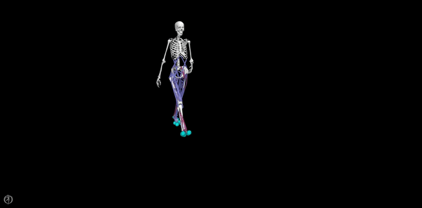

# 3D Predictive Simulations of Walking

This repository contains code and data to generate predictive simulations of human walking as described in "_Modeling toes contributes to realistic stance knee mechanics in three-dimensional predictive simulations of walking_". The paper has been submitted for publication. You can find the pre-print [here](https://www.biorxiv.org/content/10.1101/2021.08.13.456292v1).

Here is an example of a predictive simulation of walking, based on a complex musculoskeletal model (31 degrees of freedom, 92 muscles, 6 compliant foot-ground contacts per foot), generated with our framework.

The main script is `main.py` and the easiest is to start exploring the code from there. The code is for use on Windows, but please post an issue if you want support for other platforms as changes are minimal.

# Install requirements

- Open Anaconda prompt
- Create environment: `conda create -n 3dpredsim pip spyder`
- Activate environment: `activate 3dpredsim`
- Navigate to the folder where you want to download the code: eg. `cd Documents`
- Download code: `git clone https://github.com/antoinefalisse/predictsim_mtp.git`
- Navigate to the folder: `cd predictsim_mtp`
- Install required packages: `python -m pip install -r requirements.txt`

# Overview of main files:
- `main.py`: basically everything from loading data, formulating the problem, solving it, and processing the results. Yes I know, it is not fantastic pratice to have everything in one place...
- `plotResults.py`: plots of simulation results against reference data (eg, joint angles and torques, ground reaction forces, and muscle activations).
- `Figure<>.py`: scripts to reproduce figures of the publication.
- `analyzeResults<>.py`: scripts to get key numbers reported in the publication.
- The other files are mainly containing classes and functions called in `main.py`.
